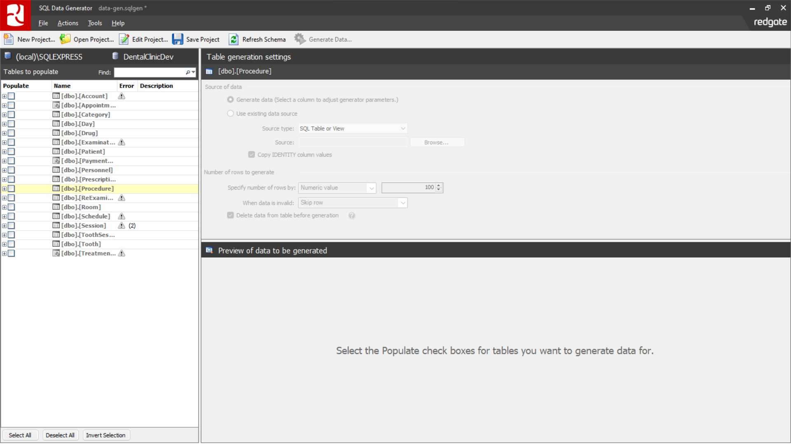
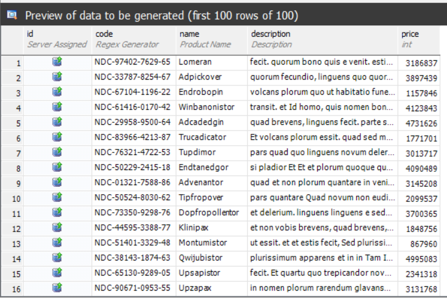

## Tool

We have decided to use [Red Gate SQL Data Generator](https://www.red-gate.com/products/dba/sql-data-generator/) to generate the data. The reason is that it is fairly easy to use and supports a wide range of data types. It also has a built-in feature to generate data based on other tables, which is useful for generating foreign keys.

### Functionalities

The tool also provides preview of the data that will be generated, which is useful for checking if the data is generated correctly. In some cases where the type of data is genereted by regex pattern, this functionality is very useful.

The tool supports rollback in case there are errors during the data generation process. In case of a successful generation, the tool will generate a notification form with the number of rows generated for each table.

The results will in most cases be instantly visible in the database, but in some cases it is necessary to refresh the database in order to see the changes.

### Limitations

- Datetime data type can be a trouble in terms of correctness due to it being generated randomly. This can lead to some cases where the data is not consistent. For example, a session can have a start time that is later than the end time.
- The tool does not support generating data based on other tables if the table is empty. This can be a problem if the table is empty and the data is generated based on that table.

## Backups

After the processs of data generating is finished, we will create a backup of the database. This is done in order to have a backup of the database in case something goes wrong during the data analysis process. The backup will then be uploaded to the Google Drive and is shared internally with the team.
